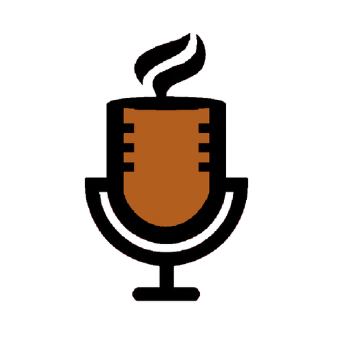
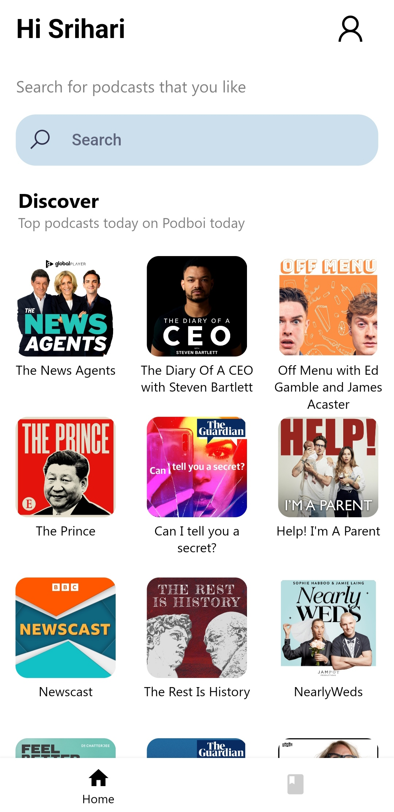
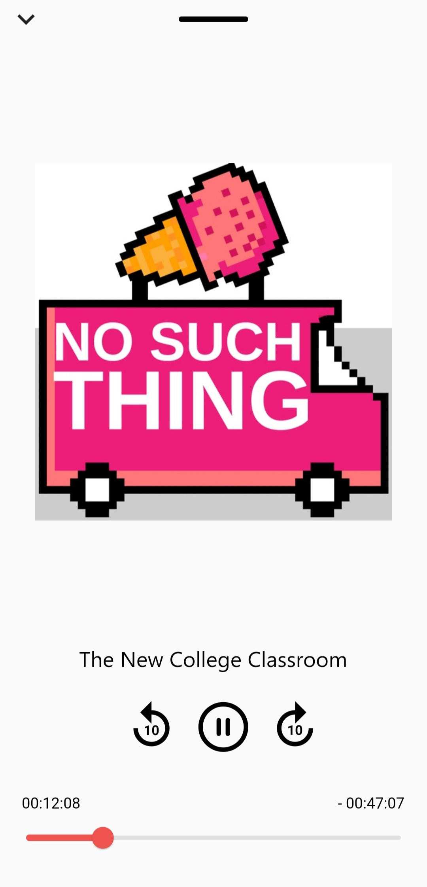
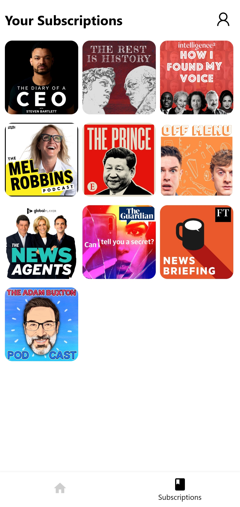
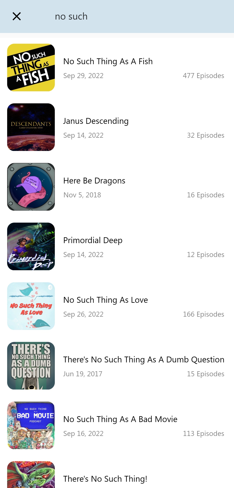
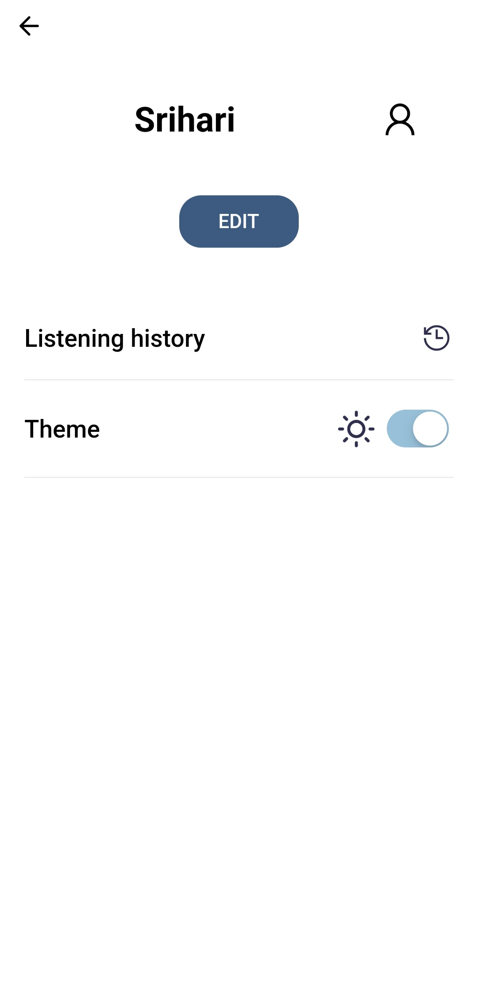
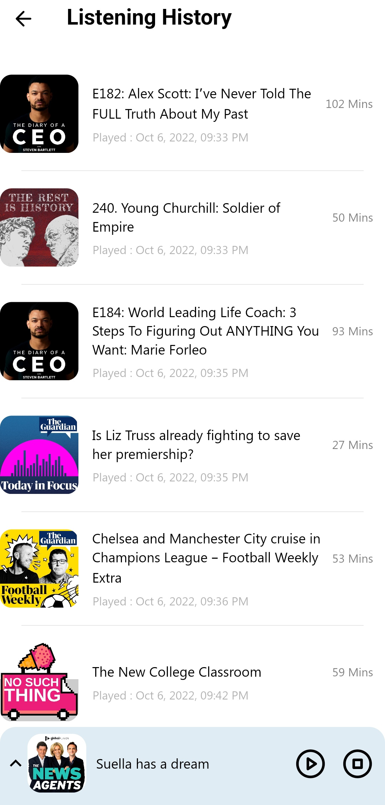
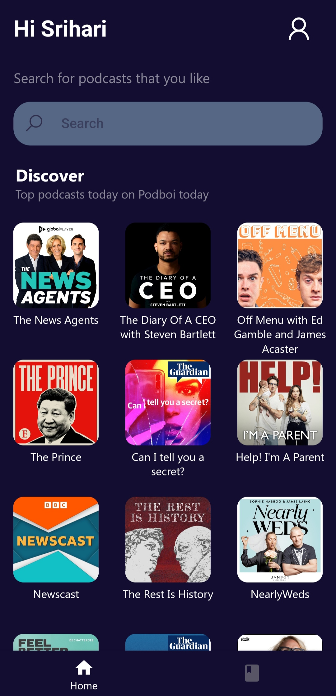
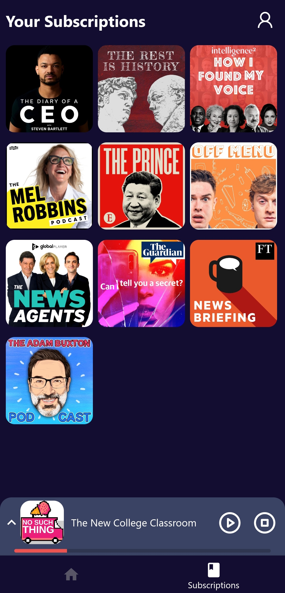
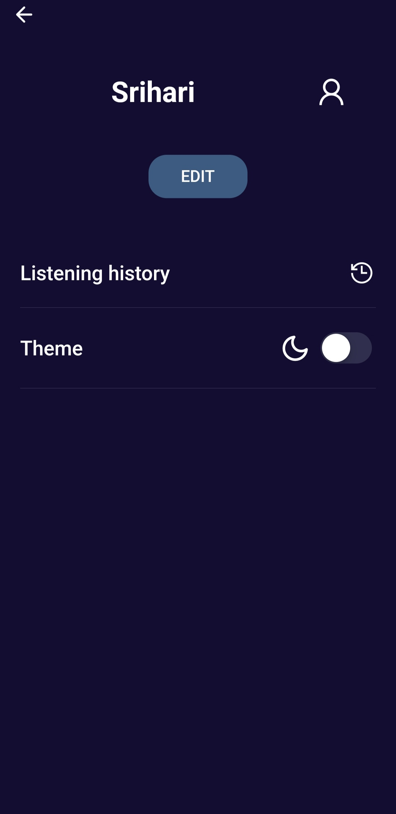

# Podboi

<p float="left">
  
 

</p>

 

Podboi is a podcast client made with flutter. Simple. Clean. Useful.

## Tech Stack:

- Flutter
- Dart

## Features:

This project is still in development stage. So, feature requests are welcome. Feel free to open an issue if you have something in mind or if something is not working right. it might make a large impact 💓

- [x] List podcasts, details and episodes
- [x] Play an episode, background playback, media controls
- [x] Mini player implementation
- [x] Light and Dark Modes
- [x] Manage Subscriptions
- [ ] Playlist (adding, removing, reordering)
- [ ] Sleep timer
- [ ] Connecting to gpodder and proper account management & backup.
 


## How to setup locally ?

1. Fork the repo.

2. Clone the repo using the forked repo.

3. Open the code in your favorite code editor.

4. Install the dependencies using the following command:

```
$ flutter pub get
```

5. Build the app using the following command:

```
$ flutter run
```

## Interested in contributing ?

See the [contributor's guide!](contributing.md)


## Screenshots
  |  |  


   |  |    


   |  |    


## Questions or issues ?

If you have general question about the project. Feel free to open an issue regarding your query/issue.

### Learn Flutter ?

Follow this [link](https://flutter.dev/)
